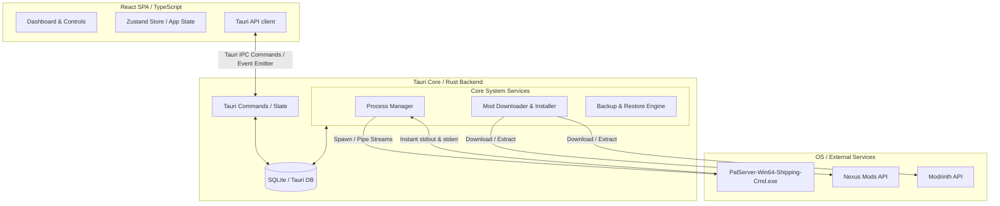

# ⚔️ Palworld Mod & Server Manager (PMM)

A professional, real-time administration dashboard and mod curation system for **Palworld Dedicated Servers**. Built with React, TypeScript, Rust, and Tauri, this application runs as a lightweight desktop companion to manage server instances, configure properties, watch logs in real-time, automate backups, and install mods directly from Nexus Mods and Modrinth APIs.

---

## 📐 Architecture Design

PMM follows a decoupled, secure client-service architecture using Tauri as the bridge between a high-performance web front-end and a native Rust system service layer.



---

## 📂 Project Structure & Codebase Map

### 🦀 Rust Backend (`src-tauri/src/`)

The backend is written in Rust using Tauri. It handles native process spawning, SQLite interaction, network calls, zip compression, and RCON socket protocols.

* **`lib.rs` / `main.rs`**: Entry points, state setup, Tauri configuration, and command registration.
* **`models.rs`**: Strongly-typed structures for configuration files, servers, ports, and API responses.
* **`db/`**: Handles SQLite setup and CRUD queries:
  * `mod.rs`: Server, backup, and settings operations (such as updating configurations and server presets).
* **`commands/`**: Handlers exposed directly to the frontend through Tauri IPC:
  * [`backup.rs`](file:///d:/client%20Project/Plaworld/src-tauri/src/commands/backup.rs): Backup creation, deletion, and restoration triggers.
  * [`config.rs`](file:///d:/client%20Project/Plaworld/src-tauri/src/commands/config.rs): Handles reading/writing `PalWorldSettings.ini` and applying presets.
  * [`rcon.rs`](file:///d:/client%20Project/Plaworld/src-tauri/src/commands/rcon.rs): Admin socket commands (Kick, Ban, Save, Broadcast, Shutdown).
  * [`scheduler.rs`](file:///d:/client%20Project/Plaworld/src-tauri/src/commands/scheduler.rs): Schedules automated server restarts.
  * [`server.rs`](file:///d:/client%20Project/Plaworld/src-tauri/src/commands/server.rs): Manages creation, installation status, and running instances.
  * [`system.rs`](file:///d:/client%20Project/Plaworld/src-tauri/src/commands/system.rs): Global app settings, firewall rules, and Nexus Mods / Modrinth API search and downloads.
* **`services/`**: Native service layer containing implementation logic:
  * [`process_manager.rs`](file:///d:/client%20Project/Plaworld/src-tauri/src/services/process_manager.rs): Pipes stdout/stderr streams to capture log outputs instantly.
  * `ini_parser.rs`: Parsers for decoding and encoding `PalWorldSettings.ini`.
  * `rcon.rs`: Custom TCP socket implementations for RCON packages.
  * `steamcmd.rs`: Downloads and updates the Palworld dedicated server using SteamCMD.
  * `backup_service.rs`: Compressed `.zip` backup creator.
  * `scheduler.rs`: Dynamic cron task engine for running scheduled restart jobs.
  * `palworld_rest_api.rs`: Integrates with Palworld's REST API for telemetry and metrics.

---

### ⚛️ React Frontend (`src/`)

The frontend is a modern React SPA using Tailwind CSS, Zustand, and TypeScript.

* **`App.tsx`**: Base view layout routing.
* **`stores/`**:
  * [`useAppStore.ts`](file:///d:/client%20Project/Plaworld/src/stores/useAppStore.ts): The single source of truth for global states (loaded servers, real-time log buffers, active notifications).
* **`components/layout/`**:
  * [`Sidebar.tsx`](file:///d:/client%20Project/Plaworld/src/components/layout/Sidebar.tsx): Collapsible navigation containing application version details and credits.
  * `TitleBar.tsx`: Custom titlebar matching desktop window frames.
* **`components/views/`**:
  * `Dashboard.tsx`: Unified command center with player tables, resource metrics, and global actions.
  * [`ServerDetail.tsx`](file:///d:/client%20Project/Plaworld/src/components/views/ServerDetail.tsx): Server control center featuring real-time stdout console logs and network copyable addresses.
  * `CreateServer.tsx`: Wizard guiding users through path configurations and presets.
  * `SettingsView.tsx`: Global mod integration and configuration card.
* **`components/tabs/`**:
  * [`ModsTab.tsx`](file:///d:/client%20Project/Plaworld/src/components/tabs/ModsTab.tsx): Real-time online mod indexing, filters, and downloads.
  * `ConfigEditor.tsx`: Visually models the server's INI parameters.
  * `BackupsTab.tsx`: Lists and triggers zip restorations.
  * `PlayersTab.tsx` / `RconConsole.tsx`: Moderation and live console utility tabs.
  * `SchedulerTab.tsx` / `LogsTab.tsx`: Restart schedules and file log views.

---

## ✨ Features

* **⚡ Real-time Console Monitor**: Reads direct unbuffered stdout streams.
* **📦 One-Click Mod Installation**: Browse, search, and download directly from Nexus Mods and Modrinth.
* **💾 Automatic Backup Engine**: Scheduled zip backups of save game folders.
* **🌐 Dynamic IP Discovery**: Instant lookup and clipboard copy function for both LAN/Local and Public connection addresses.
* **⚙️ Profile Presets**: One-click application of game profiles (`Casual`, `Balanced`, `PvP`, `Hardcore`, `Performance`).

---

## 🗃️ Database Schema

PMM stores server metadata inside a structured SQLite file:

```sql
CREATE TABLE servers (
    id INTEGER PRIMARY KEY AUTOINCREMENT,
    name TEXT NOT NULL,
    description TEXT,
    install_path TEXT NOT NULL,
    save_path TEXT NOT NULL,
    status TEXT DEFAULT 'stopped',
    game_port INTEGER DEFAULT 8211,
    rcon_port INTEGER DEFAULT 25575,
    rcon_enabled BOOLEAN DEFAULT 1,
    rest_api_port INTEGER DEFAULT 8212,
    rest_api_enabled BOOLEAN DEFAULT 1,
    max_players INTEGER DEFAULT 32,
    admin_password TEXT DEFAULT '',
    server_password TEXT,
    is_public BOOLEAN DEFAULT 0,
    preset TEXT DEFAULT 'Balanced',
    startup_args TEXT,
    crossplay_platforms TEXT DEFAULT '[]',
    auto_start BOOLEAN DEFAULT 0,
    auto_restart_schedule TEXT,
    created_at TEXT DEFAULT CURRENT_TIMESTAMP,
    last_started TEXT,
    config_json TEXT NOT NULL
);
```

---

## 🛠️ Installation & Setup

### Prerequisites
* **Node.js** (v20+)
* **Rust Toolchain** (via `rustup`)
* **Windows Build Tools** (MSVC C++ compiler)

### Running Locally
1. Clone the repository:
   ```bash
   git clone <repository-url>
   cd Plaworld
   ```
2. Install dependencies:
   ```bash
   npm install
   ```
3. Run the application in Tauri development mode:
   ```bash
   npm run tauri dev
   ```

### Building for Production
To generate a compiled production-ready executable package:
```bash
npm run tauri build
```

---

## 📝 Credits & License
* **Developer**: Sanjay
* **Copyright**: Copyright © 2026 Sanjay. All rights reserved.
